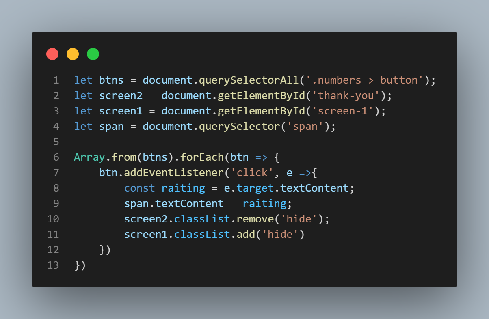
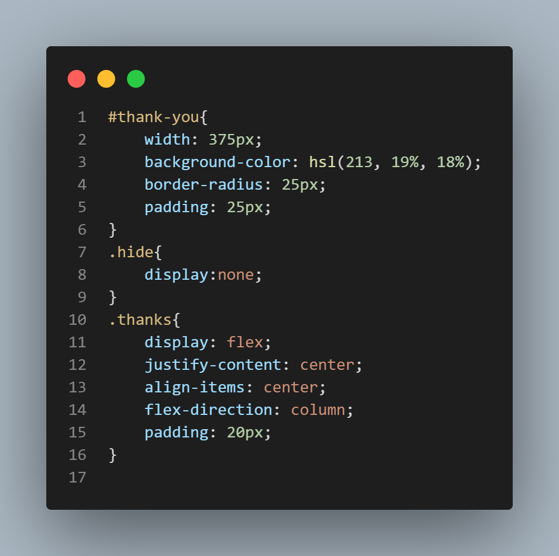
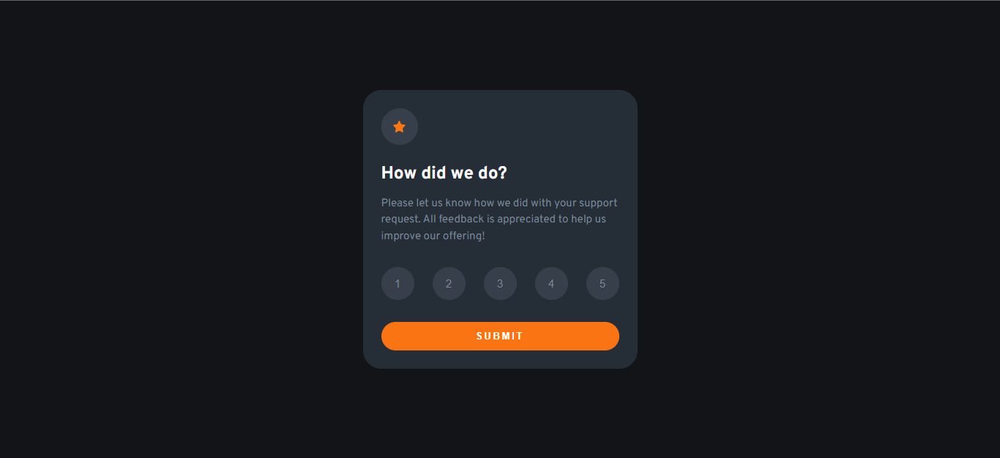
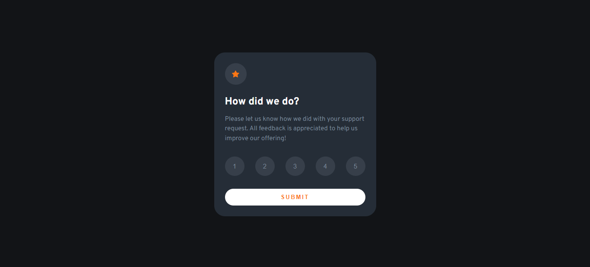
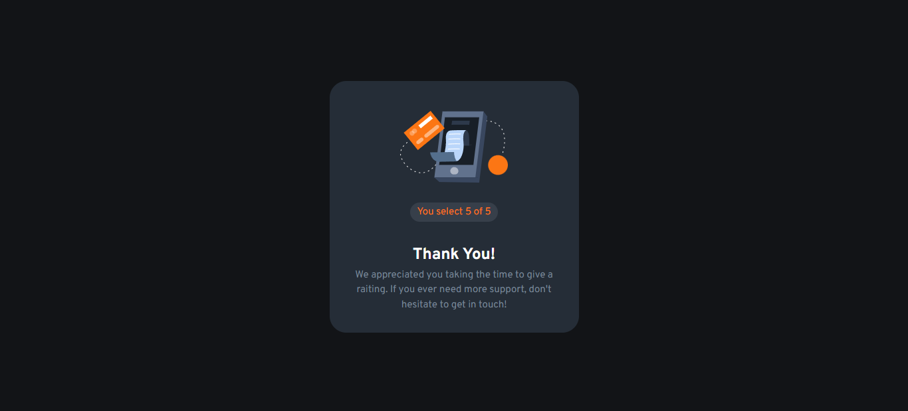

# Interactive raiting component
This project is based on a challenge from the Frontendmentor.io platform. It is an interactive component of raiting where technologies such as HTML5, CSS3 and JavaScript were used.

## Overview
This is the solution to the Frontendmentor.io interactive raiting component challenge, in which technologies were used: HTML, CSS3, JavaScript and version control was used through a Github repository.

This project can be displayed correctly at any resolution. The recommended resolutions of the challenge were

Mobile: 375 px
Desktop: 1440 px
### Screenshots

### Links

- Solution URL: [GitHub](https://github.com/yomidev/Raiting-Component)
- Live Site URL: [Github Pages]( https://yomidev.github.io/Raiting-Component/)
### Biult With

- HTML5
- CSS3
- JavaScript
- Flexbox

### What I learned

In this project I improved my CSS and HTML skills, however, I realized that I need to practice Javascript as it was a bit difficult to add the required functionality.
## Authors

- Github - [@yomidev](https://github.com/yomidev)
- Frontendmentor.io - [@yomidev](https://www.frontendmentor.io/profile/yomidev)
- Instagram - [@devinfront](https://www.instagram.com/devinfront/)
